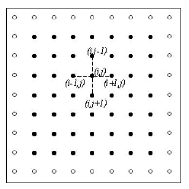
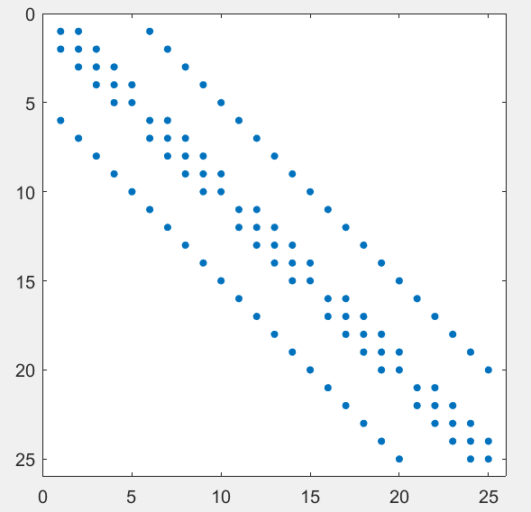

## Постановка задачи 
Необходжимо запрограммировать метод сопряженных градиентов с предобуславливателем на основе разложения Холецкого для решения задачи Дирихле.

Задача – численное решение задачи Дирихле для уравнения Пуассона, определяемую как задачу нахождения функции `u = u(x,y)`, удовлетворяющей условям:
$$\Delta u = f(x,y) \quad \text{в области } \Omega \subset \mathbb{R}^2$$
$$u(x,y) = g(x,y) \quad \text{на } \partial\Omega$$

Алгоритм решения задачи:
 - Построение СЛАУ
 - Разложение Холецкого
 - Предобуславливание
 - Метод сопряженных градиентов

### Построение СЛАУ

Для решение задачи используется апроксимация 2-й производной с помощью метода конечных разностей. Следуя конечно-разностному подходу, область решения $$\Omega$$ представляется в виде дискретного набора точек (узлов).

Прямоугольная сетка задается следующим образом:
$$D_h = \{(x_i, y_j): x_i = i \cdot h, \; y_j = j \cdot h, \; 0 \leq i,j \leq N+1\}$$
Шаг сетки: $$h = \frac{1}{N+1}$$

Используя пятиточечный шаблон для аппроксимации вторых производных, уравнение Пуассона можно представить в конечно-разностной форме:

$$u_{i-1,j} + u_{i+1,j} + u_{i,j-1} + u_{i,j+1} - 4u_{i,j} = h^2 \cdot f_{i,j}$$
Где:
 - $u_{i,j}$ — значение искомой функции в узле $(x_i, y_j)$ 
 - $f_{i,j}$ — значение правой части в узле $(x_i, y_j)$

 

 По коэффициентам уравнения, разрешенного относительно $u_{ij}$ , строится матрица. Она является пяти диагональной, так как количество точек, используемых для нахождения равно 5. Размер матрицы равен $N^2$ – количеству точек в квадрате. Блок в этой матрице имеет размер $N$ на $N$. Пример представлен для $N$ = 5:
 

 Диагонали строятся таким образом. Матрица разбивается на блоки $N$ на $N$. В тех блоках, диагональ которых совпадает с главной диагональю матрицы, выбираются их главная диагональ и 2 соседних – выше и ниже. На главной записывается 4, а на побочных -1. Это связано с коэффициентами уравнения, разрешенного относительно $u_{ij}$. Далее относительно этого блока выбираются 2 соседних, диагональ которых уже не совпадает с главной. На их главной диагонали тоже записываются -1. 

Вектор решений – “развернутая” сетка значений искомой функции $u = u(x,y)$ .
Под разверткой понимается растягивание матрицы в строку построчно – сначала первая строка слева направо, затем вторая и т.д. Вектор правой части – значения заданной функции $f(x,y)$, взятые с противоположным знаком. Однако, для тех точек, которые лежат на границе области, добавляются граничные значения, не учтенные в пяти диагональной матрице.

### Разложение Холецкого 

Дана симметричная положительно определенная матрица $A$ размерности $n * n$.  
Найти нижнюю треугольную матрицу $L$, такую что $A = L · L^T$.

```c
for j : (0, n-1):
    sum = 0
    for k : (0, j-1):
        sum = sum + L[j][k]²
    L[j][j] = sqrt(A[j][j] - sum)

    for i : (j+1, n-1):
        sum = 0
        for k : (0, j-1):
            sum = sum + L[i][k] * L[j][k]
        L[i][j] = (A[i][j] - sum) / L[j][j]

return L
```

- Матрица $A$ должна быть симметричной и положительно определенной
- Сложность алгоритма: $O(n^3)$
- Реализация может быть оптимизирована с использованием параллельных вычислений

### Предобуславливание

1. **Разложение Холецкого**:  
   $A = L * L^T$, где $L$ — нижняя треугольная матрица с положительными диагональными элементами.

2. **Прямая подстановка**:  
   Решается система $L * q = b $относительно $q$ (нижнетреугольная система).

3. **Обратная подстановка**:  
   Решается система $L^T·x = q$ относительно $x$ (верхнетреугольная система).


### Метод сопряженных градиентов с предобуславливанием

## Алгоритм PCG (Preconditioned Conjugate Gradient)

**Входные данные:**
- `A`: симметричная положительно определенная матрица (n×n)
- `b`: вектор правой части (n×1)
- `x0`: начальное приближение (n×1)
- `P`: предобуславливатель (симметричная положительно определенная матрица)
- `ε`: точность
- `max_iter`: максимальное число итераций

**Выходные данные:**
- `x`: приближенное решение системы Ax = b


Для каждой итерации $k = 0, 1, 2, ...$:

1. **Вычисление α(k):**
   $$
   \alpha^{(k)} = \frac{\mathbf{z}^{(k)} \cdot \mathbf{r}^{(k)}}{\mathbf{p}^{(k)} \cdot \mathbf{q}^{(k)}}
   $$

   где $$\mathbf{q}^{(k)} = A\mathbf{p}^{(k)}$$

2. **Обновление решения и невязки:**
   $$
   \mathbf{x}^{(k+1)} = \mathbf{x}^{(k)} + \alpha^{(k)}\mathbf{p}^{(k)}
   $$
   $$
   \mathbf{r}^{(k+1)} = \mathbf{r}^{(k)} - \alpha^{(k)}\mathbf{q}^{(k)}
   $$

3. **Решение системы с предобуславливателем:**
   $$
   P\mathbf{z}^{(k+1)} = \mathbf{r}^{(k+1)}
   $$

4. **Вычисление β(k) и нового направления:**
   $$
   \beta^{(k)} = \frac{\mathbf{z}^{(k+1)} \cdot \mathbf{r}^{(k+1)}}{\mathbf{z}^{(k)} \cdot \mathbf{r}^{(k)}}
   $$
   $$
   \mathbf{p}^{(k+1)} = \mathbf{z}^{(k+1)} + \beta^{(k)}\mathbf{p}^{(k)}
   $$


 - **Критерий остановки:** $$||r(k)|| / ||r(0)|| < ε$$
 -  **Предобуславливатель P:** Должен быть симметричным и положительно определенным. 
   - $P = L * L^T$ (где L - разложение Холецкого)


### Оптимзация с помощью параллельных вычислений

Для оптимизации были выбраны следубщие компоненты алгоритма:
 - Операции заполнения 5-ти диагональной матрицы
 - Разложение Холецкого

Операция заполнения матрицы выполняются в цикле, где каждая его итерация не зависит от других. Это создает возможность "почанковой" параллелизации  вычислений. 
Разложение Холецкого так просто нельзя выполнять параллельно - построчные и постолбцовые вычисления зависимы от предыдущих итераций. Однако в выбранном варианте разложения можно заметить, что в каждой итерации вычисления элементов в столбцах также являются независимыми, что позволяет использовать параллельные вычисления

### Используемые библиотеки
Оптимизация с использованием параллелизации алгоритма производилась с использованием 4-х вариантов:
1. Posix threads (C)
2. OpenMP (C)
3. MPI (C)
4. mpi4py (Python)

### Результаты
